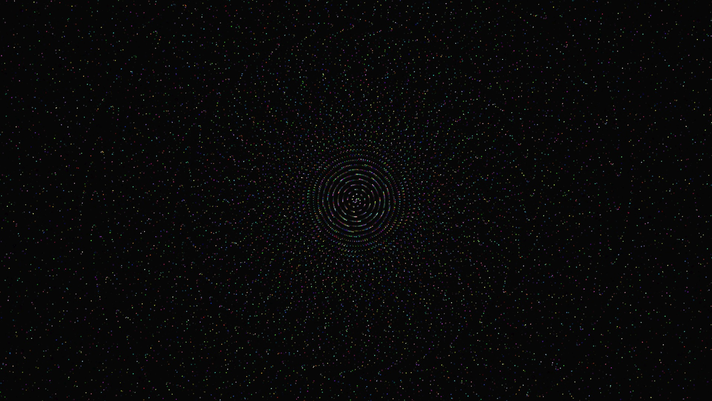
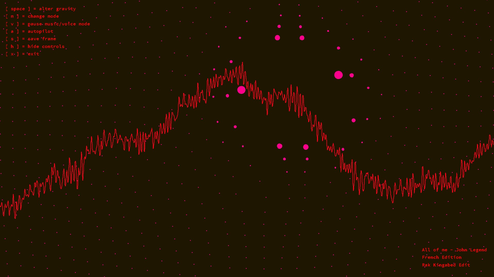
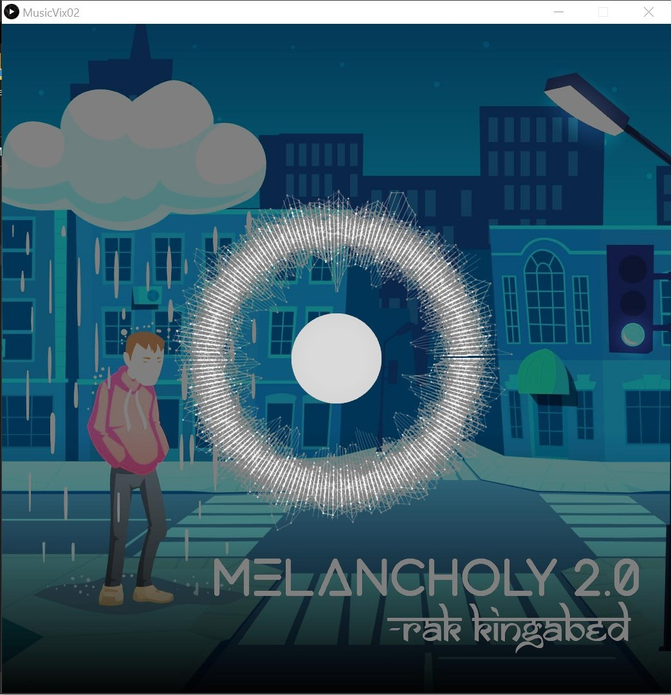
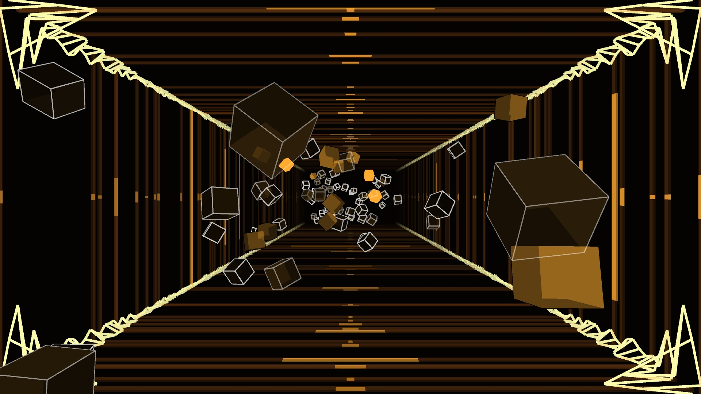
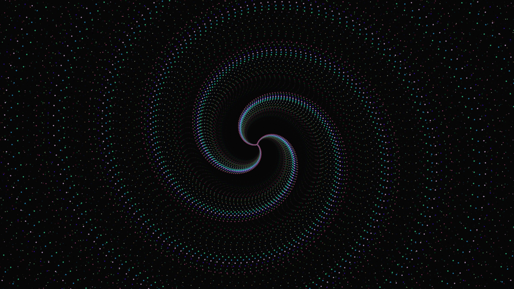

# **Music Visualizer Using Processing3 and DDF.minim Library**
  

*[Music Visualizer](https://github.com/Debagnik/Music_Visualizers_Project)* is a set of Processing3 codes which displays music responsive beautiful visuals. As of now I have made 6 music visulizer with *[Processing3](https://processing.org/)* and *[ddf/minim java audio Library](https://github.com/ddf/Minim)* 

***
**List of Programmes:** 
<ol type="i">
<li>
<ul>
<li><b>File Name:</b> MusicVix00</li>
<li><b>Song Name:</b> Ritviz - Udd Gye</li>
<li><b>Preview Link:</b> <a href="https://youtu.be/v0IzcwqNRns?t=27">Here</a></li>

</ul>
</li>

<li>
<ul>
<li><b>File Name:</b> MusicVix01</b></li>
<li><b>Song Name:</b> All of me - John Legend || French Mix || Rak Kingabed Edt</li>
<li><b>Preview Link:</b> <a hrf="https://youtu.be/V6_t-n78YnI?t=7">here</a></li>

</ul>
</li>

<li>
<ul>
<li><b>File Name:</b> MusicVix02</li>
<li><b>Song Name:</b> Melancholy 2.0 - Rak Kingabed</li>
<li><b>Preview Link:</b> <a href="https://www.linkedin.com/feed/update/urn:li:activity:6705573447105351680/">Here</a></li>

</ul>
</li>

<li>
<ul>
<li><b>File Name:</b> MusicVix03</li>
<li><b>Song Name:</b> Tony Igy - Astronomia || 80s Synthwave || Rak Kingabed Edit</li>
<li><b>Preview Link:</b> <a href="https://youtu.be/Fo7G5acogP8?t=6">Here</a></li>

</ul>
</li>

<li>
<ul>
<li><b>File Name:</b> MusicVix04</li>
<li><b>Song Name:</b> Deathbed - Coffee For head - Rak Kingabed Remix</li>
<li><b>Preview Link:</b> <a href="https://www.instagram.com/tv/CHF5GgiH7Up/?utm_source=ig_web_copy_link">Here</a></li>

</ul>
</li>

<li>
<ul>
<li><b>File Name:</b> MusicVix05</li>
<li><b>Song Name:</b> Ritviz - Thandi Hawa Remix - Rak Kingabed Edit</li>
<li><b>Preview Link:</b> <a href="https://soundcloud.com/rak_kingabed/dance-monkey-bollywood-style">Here</a></li>

</ul>
</li>
</ol>

***
# Installation guide

These are simple codes and not executables hence you need the Processing3 compilers to run these codes.

Steps
* Go to the processing3 IDE download site from [here](processing.org/download/)
* Select the proper executable for you system download and unzip it and run that
* go to **sketch** option and then select the Import Library a new window will open
* search for minim in that window and install that library.
* open the code and change the music file if needed
* Run the code

**Note**: The Preview Link music and the real music might be different.
